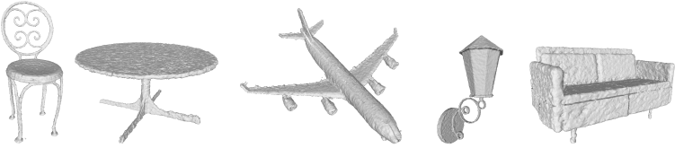
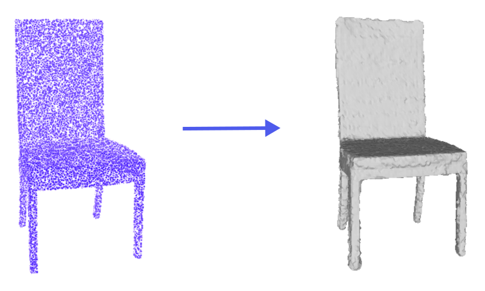

# ReconRLA: Point-based large-scale Surface Reconstruction from Point Clouds [[PDF](https://github.com/municola/surface-reconstruction/blob/master/BachelorThesis.pdf)]

This is my Bachelor Thesis.   
Advisor: [Sandro Lombardi](https://scholar.google.com/citations?hl=de&user=17JjMPoAAAAJ) 
Supervisor: [Prof. Dr. Marc Pollefeys](https://scholar.google.com/citations?hl=de&user=YYH0BjEAAAAJ) 

## Abstract
3D shape reconstruction from point clouds is a crucial part in many computer graphics and vision applications like autonomous driving or video games. While classical methods suffer from large computational efforts or memory footprints for detailed reconstructions, recent approaches use deep neural nets to implicitly represent the input shape, which enables them to generate possibly infinite resolution meshes. Although these approaches return state-ofthe-art results on synthetic data sets, most do not scale to larger scenes. They either fail to produce accurate representations or become computationally intractable for larger point clouds. Implicit based methods that do scale use fast hierarchical grid structures, which have complex implementations and additional overhead. In this work we present a pipeline that operates directly on point clouds, which makes our method scalable and efficient. Further it is a lightweight and simple architecture that can be easily extended. Our approach gives good qualitative and quantitative results on synthetic datasets and generalizes to large-scale scenes. Lastly we show that our neural net generates comparable results to state-of-the-art reconstructions on noisy real-world data

## Task
Given a 3D input point cloud, return a 3D mesh reconstruction.

For example we get (up to multiple millions) of points that lie on the surface of a chair. By applying our reconstruction Pipeline, we can then return the corresponding 3D mesh representation, hence a 3D model of the chair.

## Implementation details
**Arichtecture**: VAE + GNN (The whole Architecture is a variational autoencoder. In the encoding step we use an attention-based Graph neural network to assign each point a feature vector, which we then use in the implicit decoder to predict a signed distance function value. Based on these predictions a marching cubes algorithm then returns the 3D mesh.)  
 
**Performance**: We peform on par with [DeepSDF](https://openaccess.thecvf.com/content_CVPR_2019/papers/Park_DeepSDF_Learning_Continuous_Signed_Distance_Functions_for_Shape_Representation_CVPR_2019_paper.pdf) (MIT, Facebook Reality Labs) and outperform [OccNet](https://openaccess.thecvf.com/content_CVPR_2019/papers/Mescheder_Occupancy_Networks_Learning_3D_Reconstruction_in_Function_Space_CVPR_2019_paper.pdf
) (University of Tübingen, Google Brain)  
**Frameworks**: Pytorch, Pytorch-lightning, Hydra  
**Programming Languge**: Python

